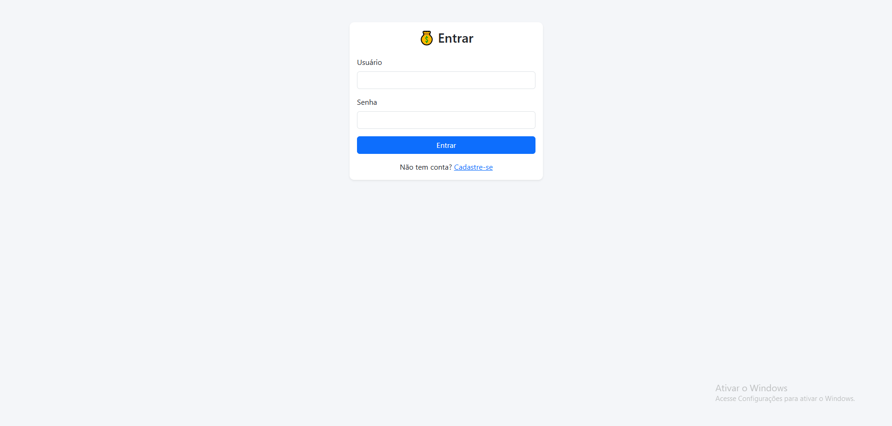
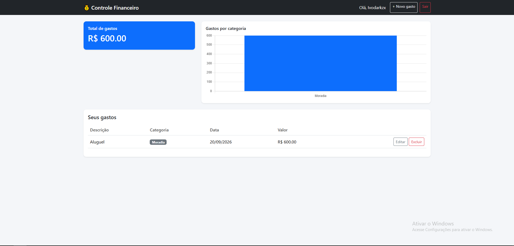
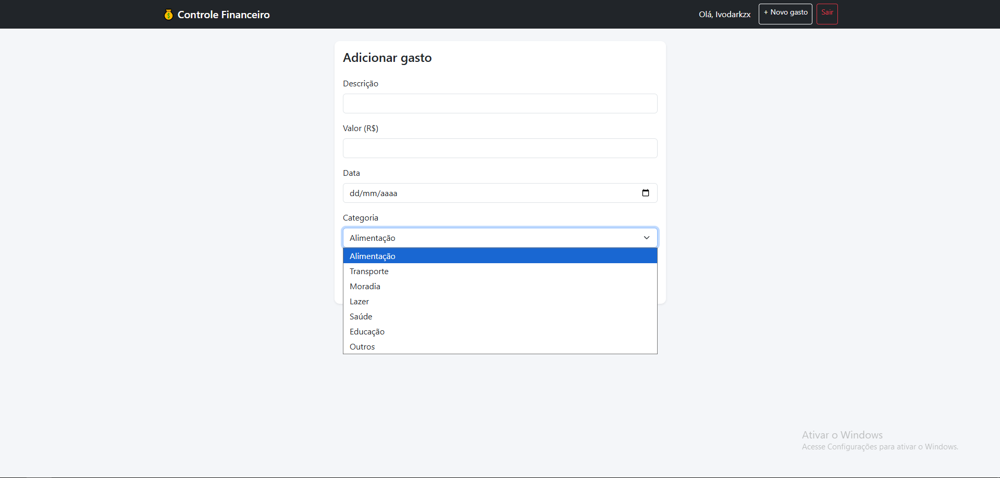

# 💰 Controle Financeiro Pessoal

Aplicação web full stack para registro e acompanhamento de gastos pessoais, com autenticação de usuários, categorização de despesas e um dashboard visual com gráficos.


## 📋 Sobre o projeto

Sistema onde cada usuário cria sua própria conta e gerencia seus gastos de forma independente. O projeto foi desenvolvido para praticar conceitos de backend, modelagem de banco de dados relacional e integração entre front-end e back-end.

## ✨ Funcionalidades

- Cadastro e login de usuários com senha criptografada
- CRUD completo de gastos (criar, listar, editar, excluir)
- Categorização de despesas (Alimentação, Transporte, Moradia, etc.)
- Dashboard com total de gastos e gráfico por categoria
- Cada usuário só visualiza e gerencia seus próprios dados

## 🛠️ Tecnologias utilizadas

**Back-end**
- Python 3
- Flask
- Flask-SQLAlchemy (ORM)
- Flask-Login (autenticação e sessões)
- Werkzeug (hash de senhas)

**Banco de dados**
- SQLite

**Front-end**
- HTML5 + Jinja2 (templates)
- Bootstrap 5
- Chart.js (gráficos)

## 🗂️ Estrutura do banco de dados

O sistema possui três tabelas relacionadas:

- **User** — armazena os usuários e senhas (hash)
- **Category** — categorias fixas de despesas
- **Expense** — gastos, relacionados a um usuário (`user_id`) e a uma categoria (`category_id`)

## 🚀 Como rodar o projeto localmente

```bash
# 1. Clone o repositório
git clone https://github.com/Ivodarkzin/finance-tracker.git
cd finance-tracker

# 2. Crie um ambiente virtual
python -m venv venv
source venv/bin/activate  # Windows: venv\Scripts\activate

# 3. Instale as dependências
pip install -r requirements.txt

# 4. Rode a aplicação
python app.py
```

Acesse **http://127.0.0.1:5000** no navegador. O banco de dados SQLite e as categorias padrão são criados automaticamente na primeira execução.

## 📸 Telas do sistema

### 🔐 Tela de Login



### 📊 Dashboard



### 💰 Controle de Gastos




## 🔮 Possíveis melhorias futuras

- Filtro de gastos por período (mês/ano)
- Exportação de relatórios em PDF/CSV
- Edição de categorias pelo usuário
- Deploy em produção (Render, Railway ou PythonAnywhere)

## 👤 Autor

Desenvolvido por **Ivo Maciel** — estudante de Análise e Desenvolvimento de Sistemas (ADS).

[LinkedIn](#) • [GitHub](#)
